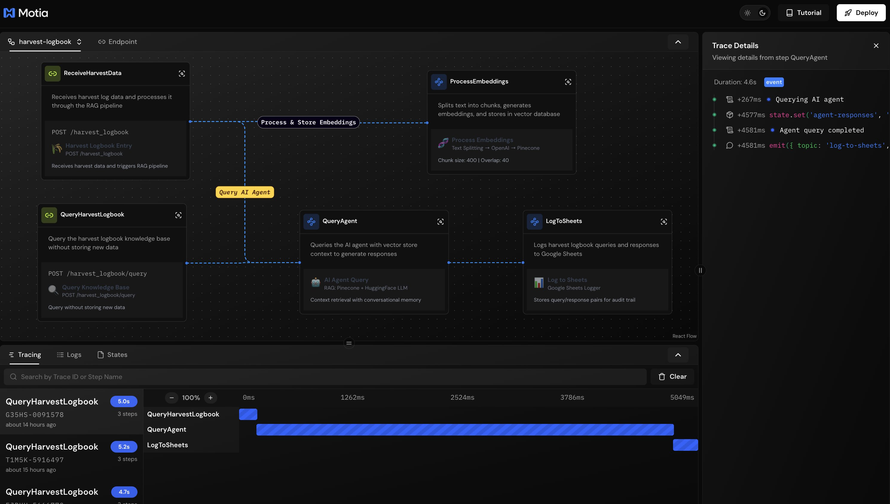

# Harvest Logbook RAG System 🌾

A production-ready **RAG (Retrieval Augmented Generation)** system for managing agricultural harvest logs with AI-powered querying. Store harvest data, generate embeddings, and query your knowledge base using natural language.


## 🎯 What This Example Demonstrates

- **RAG Pipeline**: Complete implementation of Retrieval Augmented Generation
- **Vector Search**: Semantic search using Pinecone vector database
- **Event-Driven Architecture**: Async processing with Motia events
- **Flexible LLM Integration**: Switch between OpenAI and HuggingFace
- **Multiple Logging Options**: CSV (testing) or Google Sheets (production)
- **State Management**: Coordination across workflow steps
- **Custom UI Components**: Beautiful Motia Workbench visualizations

## 🏗️ Architecture


### Workflow Flow

1. **Receive Data**: API endpoint accepts harvest log entries
2. **Split & Embed**: Text is chunked (400 chars, 40 overlap) and embedded via OpenAI
3. **Vector Storage**: Embeddings stored in Pinecone for similarity search
4. **Query Processing**: Natural language queries retrieve relevant context
5. **AI Generation**: LLM generates responses using retrieved context (RAG)
6. **Logging**: Results logged to CSV or Google Sheets

## 🚀 Quick Start

### Prerequisites

- Node.js 18+ or Bun
- OpenAI API key
- Pinecone account with an index created

### 1. Install Dependencies

```bash
npm install
```

### 2. Configure Environment

Copy `.env.example` to `.env` and fill in your credentials:

```bash
cp .env.example .env
```

**Required variables:**
```bash
OPENAI_API_KEY=sk-proj-xxxxx          # OpenAI API key
PINECONE_API_KEY=pcsk_xxxxx           # Pinecone API key
PINECONE_INDEX_HOST=your-index-abc123.svc.us-east-1.pinecone.io
```

**Get your Pinecone Index Host:**
1. Go to [Pinecone Console](https://app.pinecone.io/)
2. Click your index → **Connect** tab
3. Copy the **Host** value

### 3. Create Pinecone Index

Create an index with these settings:
- **Dimensions**: `1536` (for OpenAI text-embedding-ada-002)
- **Metric**: `cosine`
- **Name**: Your choice (e.g., `harvest_logbook`)

### 4. Start the Server

```bash
npm run dev
```

## 📝 Usage Examples

### Store Harvest Data

```bash
curl -X POST http://localhost:3000/harvest_logbook \
  -H "Content-Type: application/json" \
  -d '{
    "content": "Harvested 500kg of tomatoes from field A. Weather was sunny with no pest damage observed. Quality excellent.",
    "metadata": {
      "field": "A",
      "crop": "tomatoes",
      "weight_kg": 500,
      "quality": "excellent"
    }
  }'
```

### Store Data + Query Immediately

```bash
curl -X POST http://localhost:3000/harvest_logbook \
  -H "Content-Type: application/json" \
  -d '{
    "content": "Harvested 300kg of corn from field B. Some pest damage observed.",
    "query": "What is the total harvest weight today?",
    "metadata": {
      "field": "B",
      "crop": "corn",
      "pest_damage": true
    }
  }'
```

### Query Knowledge Base

```bash
curl -X POST http://localhost:3000/harvest_logbook/query \
  -H "Content-Type: application/json" \
  -d '{
    "query": "Which fields had pest damage this week?"
  }'
```

### Query with Conversation History

```bash
curl -X POST http://localhost:3000/harvest_logbook/query \
  -H "Content-Type: application/json" \
  -d '{
    "query": "What about tomatoes?",
    "conversationHistory": [
      {
        "role": "user",
        "content": "Show me harvests from field A"
      },
      {
        "role": "assistant",
        "content": "Field A had 500kg of tomatoes harvested..."
      }
    ]
  }'
```

## 🔧 Configuration Options

### LLM Provider

**Option 1: OpenAI Chat** (Default, recommended)
```bash
USE_OPENAI_CHAT=true
OPENAI_API_KEY=sk-proj-xxxxx
```

**Option 2: HuggingFace**
```bash
USE_OPENAI_CHAT=false
HUGGINGFACE_API_KEY=hf_xxxxx  # Requires inference API permissions
```

**Code Reference**: `src/services/harvest-logbook/index.ts:72`

### Logging Backend

**Option 1: CSV Logger** (Default, for testing)
```bash
USE_CSV_LOGGER=true
# Logs saved to: logs/harvest_logbook.csv
```

**Option 2: Google Sheets** (Production)
```bash
USE_CSV_LOGGER=false
GOOGLE_SHEETS_ID=your_spreadsheet_id
GOOGLE_SHEETS_ACCESS_TOKEN=your_oauth_token
```

**Code Reference**: `src/services/harvest-logbook/index.ts:134`

## 📁 Project Structure

```
harvest-logbook-rag/
├── src/services/harvest-logbook/
│   ├── types.ts                    # TypeScript types
│   ├── text-splitter.ts           # Text chunking utility
│   ├── openai-service.ts          # OpenAI embeddings
│   ├── openai-chat-service.ts     # OpenAI chat (alternative)
│   ├── huggingface-service.ts     # HuggingFace chat (alternative)
│   ├── pinecone-service.ts        # Vector storage
│   ├── csv-logger.ts              # CSV logging (alternative)
│   ├── sheets-service.ts          # Google Sheets (alternative)
│   └── index.ts                   # Main orchestration
├── steps/harvest-logbook/
│   ├── receive-harvest-data.step.ts/.tsx    # API: Store data
│   ├── process-embeddings.step.ts/.tsx      # Event: Embeddings
│   ├── query-agent.step.ts/.tsx             # Event: AI query
│   ├── query-only.step.ts/.tsx              # API: Query only
│   └── log-to-sheets.step.ts/.tsx           # Event: Logging
├── .env.example                   # Environment template
└── README.md                      # This file
```

## 🎨 Motia Workbench Features

Each step includes custom UI components:

- 🌾 **Harvest Entry** - Webhook endpoint with metadata display
- 🧬 **Process Embeddings** - Shows chunking parameters (400/40)
- 🤖 **AI Agent** - RAG pipeline with source indicators
- 📊 **Log Results** - CSV or Google Sheets destination
- 🔍 **Query Only** - Dedicated query endpoint

## 🔑 Key Features

✅ **Full RAG Implementation** - Vector search + context-aware generation  
✅ **Event-Driven Processing** - Non-blocking async workflows  
✅ **Flexible Configuration** - Swap LLM providers and logging backends  
✅ **Type-Safe** - Full TypeScript with Zod validation  
✅ **Production-Ready** - Error handling, retry logic, state management  
✅ **Scalable** - Horizontal scaling with Motia's architecture  
✅ **Beautiful UI** - Custom Workbench components for visualization  

## 💡 Use Cases

- **Agriculture**: Track harvest logs with AI-powered insights
- **Inventory Management**: Store and query product information
- **Knowledge Base**: Build searchable documentation systems
- **Customer Support**: Create FAQ systems with semantic search
- **Research**: Organize and query research notes

## 🐛 Troubleshooting

### "fetch failed" - Pinecone Connection

**Issue**: `PINECONE_INDEX_HOST` not configured correctly

**Solution**:
1. Get host from Pinecone Console → Your Index → Connect tab
2. Format: `your-index-abc123.svc.us-east-1.pinecone.io` (no `https://`)
3. Restart server after updating `.env`

### "403" - HuggingFace Permissions

**Issue**: API key lacks inference permissions

**Solution**: Switch to OpenAI Chat (recommended)
```bash
USE_OPENAI_CHAT=true
```

### Empty Query Results

**Issue**: No data in Pinecone yet

**Solution**: First store some data before querying

## 📊 View Logs

**CSV Logs** (default):
```bash
cat logs/harvest_logbook.csv
```

**Google Sheets**: Check your configured spreadsheet

## 🚀 Deployment

This example is ready for production deployment:

1. **Environment**: Update `.env` with production credentials
2. **Logging**: Switch to Google Sheets (`USE_CSV_LOGGER=false`)
3. **Security**: Add authentication middleware to API steps
4. **Monitoring**: Enable logging and metrics tracking

## 📚 Learn More

- [Motia Documentation](https://motia.dev/docs)
- [RAG Pattern Guide](https://motia.dev/docs/patterns/rag)
- [OpenAI Embeddings](https://platform.openai.com/docs/guides/embeddings)
- [Pinecone Documentation](https://docs.pinecone.io/)

## 🤝 Contributing

This example is part of the [Motia Examples Repository](https://github.com/MotiaDev/motia-examples). Contributions welcome!

---

**Built with ❤️ using Motia** - Originally converted from n8n workflow to production-ready scalable backend
